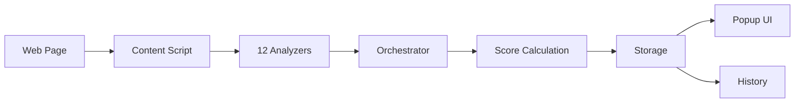

# Vizhi.ai Analytics Documentation

> 👁️ **The Eye into AI Readiness** - Complete guide to all 12 analysis pillars

## Overview

Vizhi.ai is a 100% local browser extension that audits web pages for AI-readiness. All analysis happens client-side without sending data to any server. The extension evaluates pages across 12 key pillars and provides an overall AI Readiness Score (0-100).

## Scoring System

### Pillar Weights

Each pillar contributes differently to the overall score based on its importance to AI systems:

| Pillar | Weight | Focus Area |
|--------|--------|------------|
| **Answerability** | 18% | Semantic content structure, question-answer format |
| **Indexability** | 15% | Crawlability, robots directives, canonical URLs |
| **Structured Data** | 12% | Schema.org markup, Open Graph, JSON-LD |
| **Performance** | 12% | Core Web Vitals, LCP, CLS, TTFB |
| **Accessibility** | 12% | Alt text, contrast, ARIA labels, semantic HTML |
| **Freshness** | 8% | Publication dates, content updates |
| **Entity & Brand** | 8% | Organization schema, brand consistency |
| **Internal Linking** | 7% | Contextual links, anchor text quality |
| **Multimodal** | 7% | Image captions, video transcripts, alt quality |
| **RAG-Friendly** | 5% | Anchor IDs, tables, definitions, chunking |
| **E-E-A-T** | 5% | Expertise, authoritativeness, trustworthiness |
| **LLM Discovery** | 3% | llms.txt file, AI-specific metadata |

**Total:** 100%

### Score Calculation

```javascript
Overall Score = Σ(Pillar Score × Pillar Weight) / Σ(Pillar Weights)
```

Some pillars (Answerability, Internal Linking) are adjusted by a **boilerplate dampening factor** to account for content-to-noise ratio.

### Score Grading

- **70-100**: 🟢 Excellent - AI-ready
- **40-69**: 🟡 Good - Room for improvement  
- **0-39**: 🔴 Needs Work - Critical issues

## The 12 Pillars

### 1. [Indexability](pillars/indexability.md) (15%)
Controls whether AI crawlers can access and understand your page structure.

**Key Checks:**
- Robots meta tags
- Canonical URLs
- Heading hierarchy
- Viewport configuration
- Hreflang tags

### 2. [Structured Data](pillars/structured-data.md) (12%)
Rich markup that helps AI systems understand your content semantically.

**Key Checks:**
- JSON-LD schemas (Article, FAQ, Organization)
- Open Graph tags
- Twitter Card metadata
- Schema.org compliance

### 3. [Answerability](pillars/answerability.md) (18%)
How well your content answers questions and provides citable information.

**Key Checks:**
- Semantic text chunks
- Question-format headings
- Factual density
- Citable content blocks
- Clear information structure

### 4. [Freshness](pillars/freshness.md) (8%)
Content recency signals for AI systems.

**Key Checks:**
- Publication dates (meta, schema, Open Graph)
- Last modified dates
- Content age assessment

### 5. [Entity & Brand](pillars/entity-brand.md) (8%)
Brand recognition and entity clarity for knowledge graphs.

**Key Checks:**
- Organization schema
- SameAs links (social profiles)
- Brand consistency
- Contact information
- Trust pages (privacy, terms, about)

### 6. [Performance](pillars/performance.md) (12%)
Page speed and user experience metrics that affect AI crawler budgets.

**Key Checks:**
- Largest Contentful Paint (LCP)
- Cumulative Layout Shift (CLS)
- Time to First Byte (TTFB)
- Render-blocking resources
- Page weight

### 7. [Accessibility](pillars/accessibility.md) (12%)
Accessibility features that also improve AI understanding.

**Key Checks:**
- Image alt text coverage and quality
- Color contrast ratios
- Form labels and ARIA attributes
- Language attributes
- Semantic heading structure

### 8. [Internal Linking](pillars/internal-linking.md) (7%)
How well you connect related content within your site.

**Key Checks:**
- Internal link density
- Contextual link placement
- Descriptive anchor text
- Link distribution

### 9. [Multimodal](pillars/multimodal.md) (7%)
Non-text content accessibility for multimodal AI systems.

**Key Checks:**
- Figure captions
- Video transcripts/subtitles
- Alt text depth and quality
- Image context

### 10. [RAG-Friendly](pillars/rag-friendly.md) (5%)
Retrieval-Augmented Generation optimization.

**Key Checks:**
- Heading anchor IDs
- Table structures
- Definition patterns
- Fragment identifiers
- Sentence length

### 11. [E-E-A-T](pillars/eeat.md) (5%)
Experience, Expertise, Authoritativeness, and Trustworthiness signals.

**Key Checks:**
- HTTPS enforcement
- Author bylines and credentials
- Authoritative citations
- Trust pages (privacy, terms, pricing)
- No mixed content

### 12. [LLM Discovery](pillars/llms-txt.md) (3%)
AI-specific discovery and metadata files.

**Key Checks:**
- llms.txt file presence
- Content richness in llms.txt
- Proper Markdown formatting
- AI-specific directives

## Features

### 📊 Single-Page Audit
Instant AI readiness analysis of the current page with:
- Overall score (0-100)
- Per-pillar breakdown
- Detailed evidence cards
- Key issues and recommendations

### 🔍 Granular Analytics (21+ Sub-Checks)
Bilarna-style detailed analysis with:
- Pass/Fail/Warning status for each check
- Priority badges (Critical/High/Medium/Low)
- "Why it matters" explanations
- "How to fix" solutions with code examples

### 📈 Historical Tracking
IndexedDB-powered audit history:
- Trend charts (Canvas API)
- Score statistics
- Per-URL and per-domain tracking
- 90-day auto-cleanup

### 🔮 What-If Simulator
Counterfactual analysis showing projected improvements:
- Interactive sliders for 8 scenarios
- Real-time score projection
- Impact estimation per change

### 🌐 Site-Wide Auditing
Smart Discovery crawler that:
- Auto-discovers URLs from sitemap.xml
- Respects robots.txt rules
- Audits multiple pages sequentially
- Aggregates site-wide scores
- Exports JSON reports

## Technical Architecture

### Core Components

```
vizhi-ai/
├── analyzers/          # 12 pillar analysis modules
├── content-scripts/    # Orchestrator (scoring engine)
├── popup/             # Main extension UI
├── dashboard/         # Site-wide audit interface
├── utils/             # Helper functions
└── background/        # Service worker
```

### Analysis Flow

1. **Content Script** loads on page
2. **Orchestrator** runs all 12 analyzers
3. Each analyzer returns:
   - Score (0-100)
   - Evidence array
   - Issues array
   - Sub-checks (pass/fail/warning)
4. **Weighted scoring** calculates overall score
5. **Results** stored in chrome.storage + IndexedDB
6. **Popup UI** displays interactive results

### Data Flow



## Developer Guides

- [Developer Guide](developer-guide.md) - Implementation details, APIs, utilities
- [SEO Playbook](seo-playbook.md) - Optimization strategies for each pillar

## Quick Start

### For Users
1. Load extension in Chrome/Edge
2. Visit any web page
3. Click the Vizhi.ai icon
4. View your AI Readiness Score

### For Developers
```javascript
// Run audit programmatically
const result = runAudit();
console.log(result.overallScore);

// Access specific pillar
const indexability = analyzeIndexability();
console.log(indexability.score);
```

## Key Concepts

### Boilerplate Dampening
Content-heavy pages score higher than boilerplate-heavy pages. The dampening factor (0-1) reduces scores for pillars sensitive to content quality (Answerability, Internal Linking).

### Evidence-Based Scoring
Every score is backed by specific evidence:
- What was found on the page
- Why it matters for AI
- How to improve it

### 100% Local Processing
All analysis runs in the browser:
- No external API calls
- No data sent to servers
- Complete privacy

## Version History

- **v1.7** - Complete Vizhi.ai rebrand, site-wide audit fixes
- **v1.6** - Modern UI/UX with glass morphism and animations
- **v1.5** - Granular Bilarna-style analytics (21+ sub-checks)
- **v1.4** - LLM Discovery pillar, FAQ schema priority
- **v1.3** - Smart Discovery site-wide auditing
- **v1.2** - Historical tracking with IndexedDB
- **v1.1** - What-If Simulator
- **v1.0** - Initial release with 11 pillars

## Support

For issues or questions, see individual pillar documentation for detailed troubleshooting and optimization guides.

